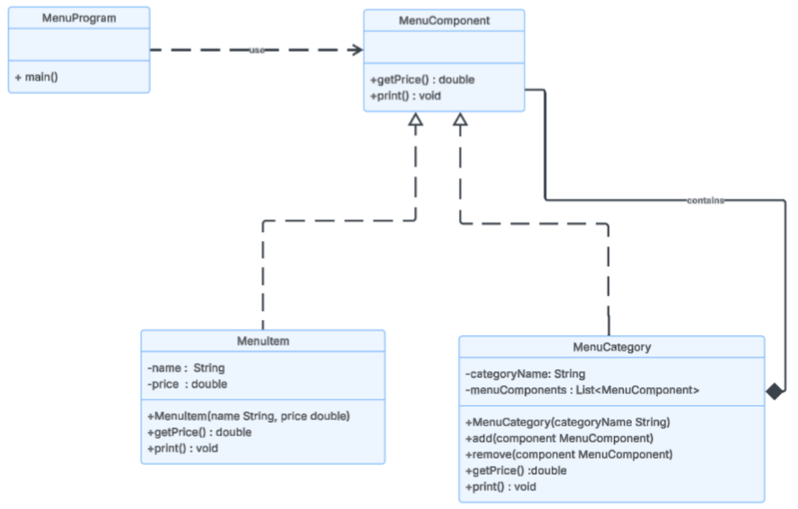

# Composite Design Pattern – Restaurant Menu System

## Overview
This project implements the **Composite Design Pattern** in Java as part of a Software Design Lab activity. It simulates a hierarchical restaurant menu for a Point-of-Sale (POS) system.

## Pattern Used
**Composite Design Pattern** — allows individual items (`MenuItem`) and groups of items (`MenuCategory`) to be treated uniformly through a shared interface (`MenuComponent`).

## Project Structure
composite-design-pattern-menu/
├── MenuComponent.java   # Component interface
├── MenuItem.java        # Leaf class
├── MenuCategory.java    # Composite class
└── RestoApp.java        # Client / main application

## How to Run
1. Clone the repository
2. Open in any Java IDE or GitHub Codespace
3. Compile and run `RestoApp.java`

## Expected Output
--- MAIN MENU ---
--- BARKADA SOLO MEAL ---

Classic Burger: ₱250.00
Large Fries: ₱85.00
Root Beer: ₱60.00
Vanilla Sundae: ₱45.00

==============================
Total Menu Value: ₱440.00

## Author
Angela R. Militar
Software Design – Composite Pattern Lab

## UML Diagram
